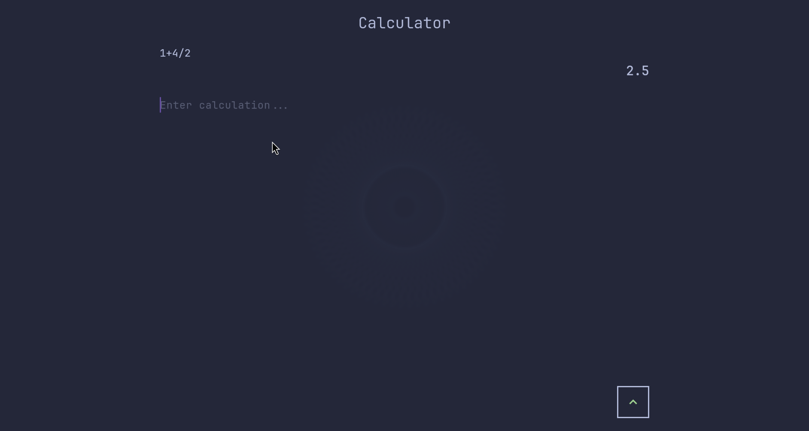

# Omarchy Calculator

A minimal opinionated calculator app for Omarchy.




## Controls

- **Text Input**: Type mathematical expressions directly
- **Enter**: Execute calculation
- **Ctrl+B or F1**: Toggle button panel
- **Button Panel**: Click the green arrow button in bottom-right corner

## Installation

### From AUR (Arch Linux)

```bash
yay -S omarchy-calculator
# or
paru -S omarchy-calculator
```

### Local Installation

```bash
git clone https://github.com/yourusername/omarchy-calculator
cd omarchy-calculator
./install.sh
```

### Manual Build

```bash
flutter pub get
flutter build linux --release
# Binary will be in build/linux/x64/release/bundle/
```

## Development

### Running in Development

```bash
flutter pub get
flutter run -d linux
```

### AUR Publishing

For maintainers who want to publish to AUR:

1. **Test the package locally:**

   ```bash
   ./aur-helper.sh build
   ./aur-helper.sh test
   ```

2. **Generate .SRCINFO:**

   ```bash
   ./aur-helper.sh srcinfo
   ```

3. **Prepare AUR repository:**

   ```bash
   ./aur-helper.sh aur
   ```

4. **Or do everything at once:**
   ```bash
   ./aur-helper.sh all
   ```

The helper script will guide you through the entire process.

## The backstory

While I was watching this Omarchy 2.0 update video, I heard that DHH didn't like the current calculator app bundled with Omarchy. So I thought I'd make one to the style of the distro.
In that same video, he mentions that he loves [Typora](https://typora.io/), a very minimal and focused text editor, so I chose to make this calculator similar in style while not missing too many features.
That same day I was scrolling on X when I saw this [post](https://x.com/aloisdeniel/status/1959979080331518079) by [Aloïs Deniel](https://x.com/aloisdeniel) and I saw the opportunity to make something useful and easy for the distro.

## The boring part

Most of the start of this app was vibe coded, but from now on I'm committing more time and effort to making sure it's quality and that I take it as a learning opportunity.

## Thank you's

Built with Omarchy Flutter, thanks again to [Aloïs Deniel](https://x.com/aloisdeniel)
Developed under Omarchy, thanks [DHH](https://x.com/dhh) for the amazing distro
